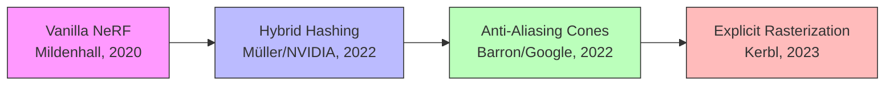
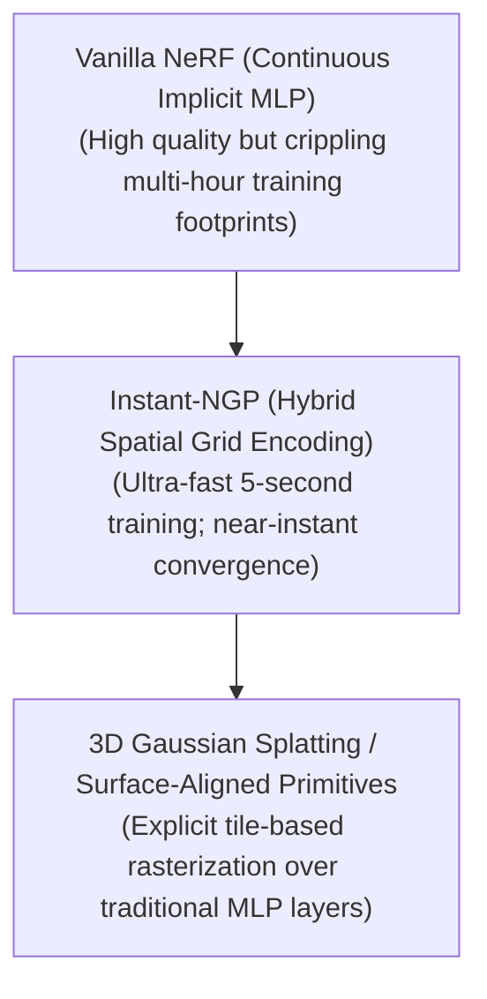

# Awesome-Neural-Radiance-Fields

## Neural Radiance Fields: History, Progression, Variants, & Applications

**Neural Radiance Fields (NeRF)** represent a foundational paradigm shift in computer vision, computer graphics, and neural 3D scene representation. Formally introduced by Mildenhall et al. (UC Berkeley, Google Research, UC San Diego) in 2020 ("NeRF: Representing Scenes as Neural Radiance Fields for View Synthesis"), NeRF established a revolutionary method for mapping continuous 3D environments into the weights of a neural network.

Prior to NeRF, 3D reconstruction relied on explicit, discrete geometric representations such as voxel grids, polygon meshes, or point clouds. These structures struggled with complex topology, specular reflections, and translucent boundaries. NeRF inverted this by treating the entire 3D scene as an **implicit, continuous volumetric function**. By training a Multi-Layer Perceptron (MLP) to output color and volume density for any spatial coordinate, NeRF proved that deep networks could synthesize photorealistic novel views with intricate lighting effects, completely redefining the boundary between deep learning and computer graphics.

---

## 1. The Macro Chronological Evolution

The implementation of neural view synthesis has transitioned from slow, coordinate-based continuous MLPs to hybrid sparse data structures, paving the way for explicit Gaussian rasterization primitives.

*   **The Continuous Implicit Coordinate Era (Vanilla NeRF, 2020)**
    *   *Concept:* Represented 3D scenes implicitly by training an MLP to map continuous 3D spatial locations $(x, y, z)$ and 2D viewing directions $(\theta, \phi)$ to volume density $\sigma$ and view-dependent RGB color.
    *   *Limitation:* Extremely intensive training and inference bounds. Synthesizing a single frame required casting millions of rays, querying the dense MLP hundreds of times per ray. This meant a single scene took up to 1-2 days to train and required several seconds or minutes to render a single frame.
*   **The Anti-Aliasing Cone Optimization Shift (Mip-NeRF, 2021–2022)**
    *   *Concept:* Replaced the traditional singular coordinate ray with continuous conical frustums to sample regions of space rather than infinitely small points.
    *   *Significance:* Fixed severe aliasing and blurring artifacts that occurred when the virtual rendering camera zoomed in or out. It dramatically improved reconstruction accuracy across multi-scale viewpoint changes.
*   **The Hybrid Structural Grid Revolution (Instant-NGP, 2022)**
    *   *Concept:* Introduced Multiresolution Hash Encoding. Instead of relying solely on the capacity of deep MLP layers to memorize spatial details, it mapped spatial coordinates into a localized, learnable feature grid backed by a fast hash table.
    *   *Significance:* Slashed NeRF training times from days down to **under 5 seconds**. By passing pre-encoded local features into a tiny, shallow MLP, it eliminated the computational bottleneck of deep network backpropagation.
*   **The Explicit Primitive Hand-Off (3D Gaussian Splatting, 2023–Present)**
    *   *Concept:* Replaced implicit spatial coordinate networks with explicit, unstructured collections of millions of 3D anisotropic Gaussians rasterized via parallel GPU tile routines.
    *   *Significance:* Achieved **100+ FPS real-time rendering** while maintaining state-of-the-art visual fidelity, shifting the industry focus from implicit neural weights to explicit differentiable geometric primitives.

---

## 2. Core Functional & Mathematical Primitives

The core architecture of a Neural Radiance Field maps spatial rays using continuous positional mapping combined with volumetric rendering integrals.

*   Positional Encoding
    *   **Mechanism:** Deep neural networks suffer from a spectral bias favoring low-frequency functions, making them naturally prone to generating blurry textures. NeRF bypasses this by projecting low-dimensional coordinates into a higher-dimensional periodic space using a series of sine and cosine transformations:
        $$\gamma(p) = \left( \sin(2^0\pi p), \cos(2^0\pi p), \dots, \sin(2^{L-1}\pi p), \cos(2^{L-1}\pi p) \right)$$
        This mapping allows the MLP to learn high-frequency spatial details and micro-textures.

*   Differentiable Volume Rendering
    *   **Mechanism:** To calculate pixel colors, the system casts a virtual camera ray $r(t) = o + td$ through the continuous field. The expected color $C(r)$ of the ray is computed by integrating the generated colors $c$ weighted by their density $\sigma$ and continuous transmission probability $T(t)$:
        $$C(r) = \int_{t_n}^{t_f} T(t) \sigma(r(t)) c(r(t), d) \, dt, \quad \text{where } T(t) = \exp\left( -\int_{t_n}^t \sigma(r(s)) \, ds \right)$$

---

## 3. High-Capacity Architectural & Scaling Classes

Depending on scene environments and dynamic configurations, the baseline NeRF architecture branches into specialized classes.

*   **Dynamic & Temporally Deformable NeRFs (D-NeRF / Nerfies)**
    *   *The Shift:* Baseline NeRF assumes static scenes. Dynamic extensions introduce a time component $t$ or map coordinates into a dynamic deformation field. An initial canonical MLP establishes a static base frame, while a secondary deformation MLP outputs spatial displacement vectors $(\Delta x, \Delta y, \Delta z)$ for each time frame, allowing for the reconstruction of moving objects or human expressions.
*   **Unbounded Large-Scale Environments (Block-NeRF / Mega-NeRF)**
    *   *The Shift:* Standard coordinate MLPs saturate and lose fidelity when forced to map entire city blocks or complex outdoor spaces. Unbounded architectures segment large geographic layouts into independent spatial blocks. Separate, localized NeRF networks train concurrently on dedicated grid cells, dynamically blending their boundaries during inference to render city-scale environments.

---

## 4. Production Engineering Challenges & Hardware Solutions

Deploying NeRF pipelines within industrial pipelines exposes severe hardware bottlenecks and rendering compatibility issues.

*   **The Ray-Marching Latency Bottleneck**
    *   *The Problem:* Because rendering a single pixel requires sampling hundreds of distinct point coordinates along a ray, inference demands massive memory bandwidth and strains GPU compute cores, blocking its use in real-time gaming engines.
    *   *Mitigation:* Implementing **Baking Techniques** (such as SNeRG or MERF). These approaches precompute and export the trained implicit continuous MLP fields into explicit, discrete multi-scale voxel grids or sparse textures, shifting runtime rendering costs back to standard, fast texture lookups.
*   **Varying Illumination and Shadow Contamination**
    *   *The Problem:* Real-world imagery captures environments with fluctuating shadows, varying weather, or transient moving objects. Standard NeRF models assume perfect lighting consistency, causing passing pedestrians or sunlight shifts to manifest as blurry, ghost-like artifacts.
    *   *Mitigation:* Deploying **NeRF-W (NeRF in the Wild)** pipelines. NeRF-W separates the scene into static components and variable, transient components by combining per-image appearance embedding vectors with a dedicated uncertainty field, shielding the core structure from dynamic lighting shifts.

---

## 5. Frontier Real-World AI Infrastructure Applications

*   **Digital Twinning & Industrial Site Mapping (Block-NeRF Engines)**
    *   *Application:* Generates fully interactable 3D environments of construction zones, factories, and urban areas from drone or mobile camera rigs. These models act as foundational spatial assets for structural inspections and remote site monitoring.
*   **Immersive Virtual Reality Asset Creation (Ego-centric Captures)**
    *   *Application:* Populates digital spaces with real-world objects. VR development platforms ingest standard smartphone videos and output photorealistic 3D assets that retain complex physical properties like material glare and deep surface shadows.
*   **Simulation Environments for Autonomous Vehicles (Waymo / Cruise Simulation)**
    *   *Application:* Recreates expansive real-world road networks from fleet camera logs. Autonomous vehicle platforms use these neural scenes to simulate edge-case driving conditions, modifying sunlight angles, weather patterns, or asset paths within a safe sandbox.

---

## References

* Mildenhall, B., Srinivasan, P. P., Tancik, M., Hedman, P., Cao, C., Sakhnovich, R., & Ng, R. (2020). NeRF: Representing scenes as neural radiance fields for view synthesis. European Conference on Computer Vision (ECCV).

* Barron, J. T., et al. (2021). Mip-nerf: A multiscale representation for anti-aliasing neural radiance fields. IEEE International Conference on Computer Vision (ICCV).

* Müller, T., Evans, A., Schied, C., & Keller, A. (2022). Instant neural graphics primitives with a multiresolution hash encoding. ACM Transactions on Graphics (TOG), 41(4).

