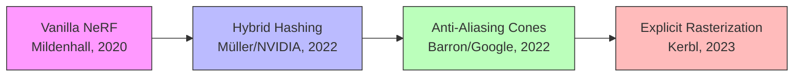
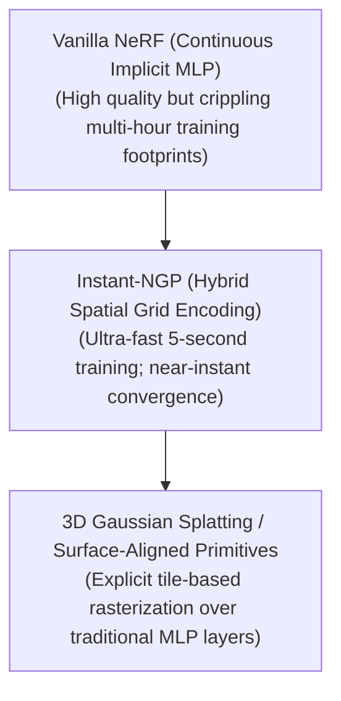

# Awesome-Neural-Radiance-Fields

## Neural Radiance Fields: History, Progression, Variants, & Applications

**Neural Radiance Fields (NeRF)** represent a foundational paradigm shift in computer vision, computer graphics, and neural 3D scene representation. Formally introduced by Mildenhall et al. (UC Berkeley, Google Research, UC San Diego) in 2020 ("NeRF: Representing Scenes as Neural Radiance Fields for View Synthesis"), NeRF established a revolutionary method for mapping continuous 3D environments into the weights of a neural network.

Prior to NeRF, 3D reconstruction relied on explicit, discrete geometric representations such as voxel grids, polygon meshes, or point clouds. These structures struggled with complex topology, specular reflections, and translucent boundaries. NeRF inverted this by treating the entire 3D scene as an **implicit, continuous volumetric function**. By training a Multi-Layer Perceptron (MLP) to output color and volume density for any spatial coordinate, NeRF proved that deep networks could synthesize photorealistic novel views with intricate lighting effects, completely redefining the boundary between deep learning and computer graphics.

---

## 1. The Macro Chronological Evolution

The implementation of neural view synthesis has transitioned from slow, coordinate-based continuous MLPs to hybrid sparse data structures, paving the way for explicit Gaussian rasterization primitives.

| Era / Approach | Details | Year | Paper Link |
|---|---|---|---|
| [**The Continuous Implicit Coordinate Era (Vanilla NeRF)**](pages/vanilla_nerf.md) | **Concept:** Represented 3D scenes implicitly by training an MLP to map continuous 3D spatial locations $(x, y, z)$ and 2D viewing directions $(\theta, \phi)$ to volume density $\sigma$ and view-dependent RGB color. **Limitation:** Extremely intensive training and inference bounds. | 2020 | [Mildenhall et al.](https://arxiv.org/abs/2003.08934) |
| [**The Anti-Aliasing Cone Optimization Shift (Mip-NeRF)**](pages/mip_nerf.md) | **Concept:** Replaced the traditional singular coordinate ray with continuous conical frustums. **Significance:** Fixed severe aliasing and blurring artifacts. | 2021 | [Barron et al.](https://arxiv.org/abs/2103.13415) |
| [**The Hybrid Structural Grid Revolution (Instant-NGP)**](pages/instant_ngp.md) | **Concept:** Introduced Multiresolution Hash Encoding. **Significance:** Slashed NeRF training times from days down to under 5 seconds. | 2022 | [Müller et al.](https://arxiv.org/abs/2201.05989) |
| [**The Explicit Primitive Hand-Off (3D Gaussian Splatting)**](pages/3d_gaussian_splatting.md) | **Concept:** Replaced implicit spatial coordinate networks with explicit, unstructured collections of millions of 3D anisotropic Gaussians. **Significance:** Achieved 100+ FPS real-time rendering. | 2023 | [Kerbl et al.](https://repo-sam.inria.fr/fungraph/3d-gaussian-splatting/) |

---

## 2. Core Functional & Mathematical Primitives

The core architecture of a Neural Radiance Field maps spatial rays using continuous positional mapping combined with volumetric rendering integrals.

| Primitive | Mechanism | Year | Paper Link |
|---|---|---|---|
| [**Positional Encoding**](pages/positional_encoding.md) | Projects low-dimensional coordinates into a higher-dimensional periodic space using sine and cosine transformations, allowing the MLP to learn high-frequency spatial details. | 2020 | [NeRF Paper](https://arxiv.org/abs/2003.08934) |
| [**Differentiable Volume Rendering**](pages/differentiable_volume_rendering.md) | Computes the expected color of a ray by integrating generated colors weighted by volume density and transmission probability along the ray. | 2020 | [NeRF Paper](https://arxiv.org/abs/2003.08934) |

---

## 3. High-Capacity Architectural & Scaling Classes

Depending on scene environments and dynamic configurations, the baseline NeRF architecture branches into specialized classes.

| Architecture | Description | Year | Paper Link |
|---|---|---|---|
| [**Dynamic & Temporally Deformable NeRFs**](pages/dynamic_nerfs.md) | Introduces a time component or deformation field to handle moving objects and dynamic scenes. | 2020 | [D-NeRF](https://arxiv.org/abs/2011.13961) |
| [**Unbounded Large-Scale Environments**](pages/unbounded_nerfs.md) | Segments large spaces into independent blocks for training, enabling rendering of city-scale environments. | 2022 | [Block-NeRF](https://arxiv.org/abs/2202.05263) |

---

## 4. Production Engineering Challenges & Hardware Solutions

Deploying NeRF pipelines within industrial pipelines exposes severe hardware bottlenecks and rendering compatibility issues.

| Challenge | Problem & Mitigation | Year | Paper Link |
|---|---|---|---|
| [**The Ray-Marching Latency Bottleneck**](pages/ray_marching_bottleneck.md) | **Problem:** Inference demands massive memory bandwidth due to dense ray sampling. **Mitigation:** Baking Techniques (SNeRG, MERF) precompute MLP fields into sparse grids or textures. | 2021 | [SNeRG](https://arxiv.org/abs/2103.14645) |
| [**Varying Illumination & Shadow Contamination**](pages/varying_illumination.md) | **Problem:** Fluctuating shadows and moving objects cause artifacts in static assumptions. **Mitigation:** NeRF-W separates scenes into static/transient components via appearance embeddings. | 2020 | [NeRF-W](https://arxiv.org/abs/2008.02268) |

---

## 5. Frontier Real-World AI Infrastructure Applications

| Application | Description | Year | Paper Link |
|---|---|---|---|
| [**Digital Twinning & Industrial Site Mapping**](pages/digital_twinning.md) | Generates interactable 3D environments of large zones from drone/camera rigs for inspections and monitoring. | 2022 | [Block-NeRF](https://arxiv.org/abs/2202.05263) |
| [**Immersive VR Asset Creation**](pages/vr_asset_creation.md) | Populates digital spaces by turning smartphone videos into photorealistic 3D assets retaining physical properties. | 2020 | [NeRF Paper](https://arxiv.org/abs/2003.08934) |
| [**Autonomous Vehicle Simulation**](pages/autonomous_vehicles.md) | Recreates real-world road networks to simulate edge-case driving conditions and lighting changes. | 2022 | [Block-NeRF](https://arxiv.org/abs/2202.05263) |

---

## References

* Mildenhall, B., Srinivasan, P. P., Tancik, M., Hedman, P., Cao, C., Sakhnovich, R., & Ng, R. (2020). NeRF: Representing scenes as neural radiance fields for view synthesis. European Conference on Computer Vision (ECCV).

* Barron, J. T., et al. (2021). Mip-nerf: A multiscale representation for anti-aliasing neural radiance fields. IEEE International Conference on Computer Vision (ICCV).

* Müller, T., Evans, A., Schied, C., & Keller, A. (2022). Instant neural graphics primitives with a multiresolution hash encoding. ACM Transactions on Graphics (TOG), 41(4).

