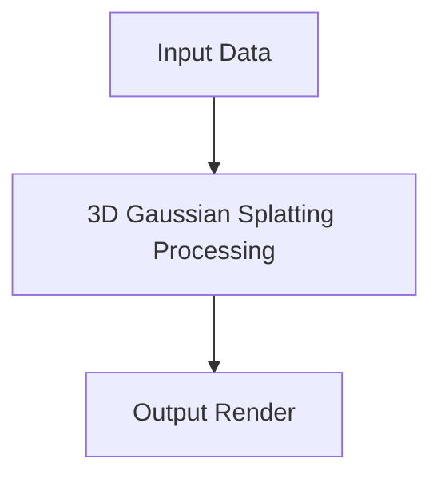

# 3D Gaussian Splatting

This page contains detailed information about 3D Gaussian Splatting.

## Overview
- **Year introduced:** 2023
- **Original Paper:** [3D Gaussian Splatting](https://repo-sam.inria.fr/fungraph/3d-gaussian-splatting/)

## Architecture Diagram

[Back to main README](../README.md)
