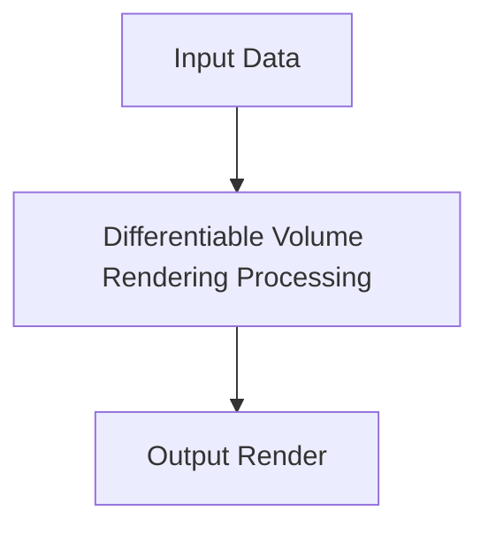

# Differentiable Volume Rendering

This page contains detailed information about Differentiable Volume Rendering.

## Overview
- **Year introduced:** 2020
- **Original Paper:** [Differentiable Volume Rendering](https://arxiv.org/abs/2003.08934)

## Architecture Diagram

[Back to main README](../README.md)
