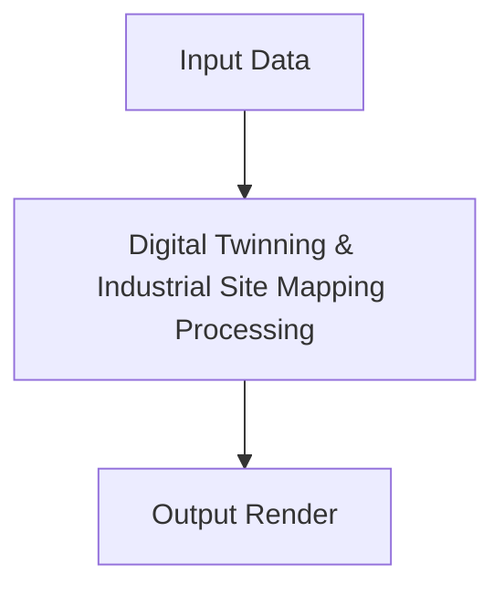

# Digital Twinning & Industrial Site Mapping

This page contains detailed information about Digital Twinning & Industrial Site Mapping.

## Overview
- **Year introduced:** 2022
- **Original Paper:** [Digital Twinning & Industrial Site Mapping](https://arxiv.org/abs/2202.05263)

## Architecture Diagram

[Back to main README](../README.md)
